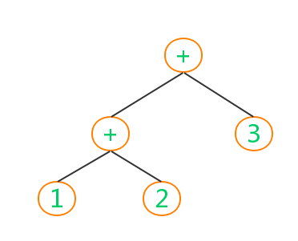

## 第一单元练习: 栈式编译器

---------------------

### 一. 描述

以一个正整数加法为例子, 语法规则就是正整数的简单加法, 比如: `1 + 2`, `1 + 2 + 3`等, 然后使用两条汇编指令实现一个栈式编译器; 这两条汇编指令为:

> 1. `push n`: 遇到一个操作数`n`, 将`n`压栈
> 2. `add`: 遇到一个`+`号, 生成一条该指令, 表示从栈中弹出两个操作数, 然后计算出结构压回栈中

----------------

### 二. 思路

先从源文件生成一个语法树, 如: `1 + 2 + 3`生成如下语法树

然后采用树的后序遍历, 遇到一个操作数就生成一条`push n`, 遇到`+`就生成`add`指令;

需要注意的是`add`命令包含的含义是: 从栈中弹出两个操作数, 然后执行相加操作, 将结果再压回栈中

----------------------

### 三. 实现

参见本项目`StackCompiler`的实现, 测试源文件是`demo.sum`, 编译出来的文件是`demo.exc`

